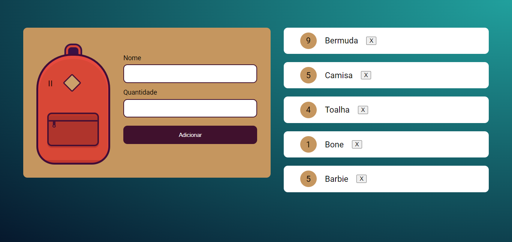
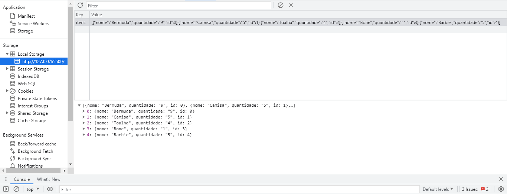

# Mochila de Viagem

Nesse projeto feito durante o curso de <b>Armazenamento de dados</b> da <b>Alura</b>, onde eu desenvolvi uma aplicação para simular uma mochila de viagem para armazenar os itens. A proposta deste projeto é o tratamento, envio e exclusão de dados no <b>LocalStorage</b> do navegador. 

<h3>Contribuindo</h3>

⭐️ Star o projeto

🐛 Encontrar e relatar issues
